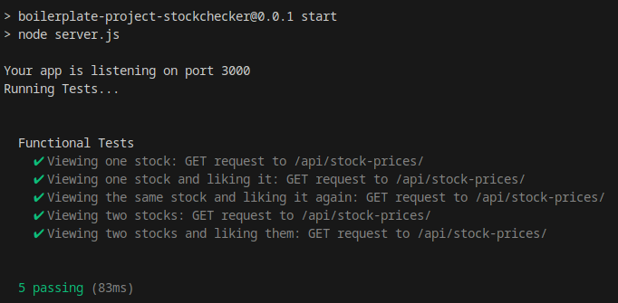
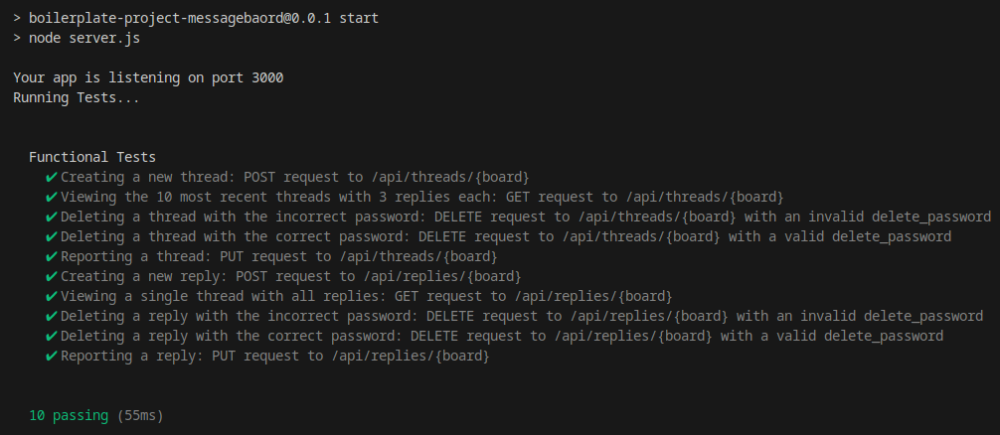
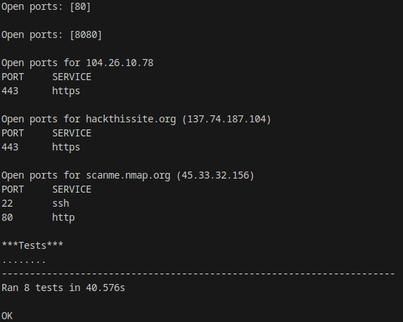
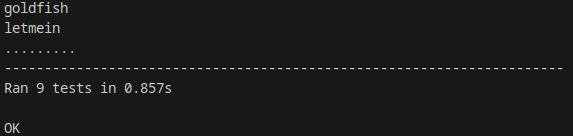
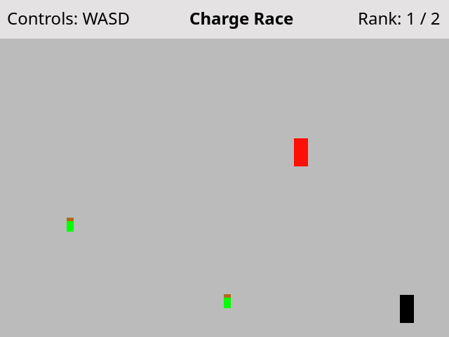
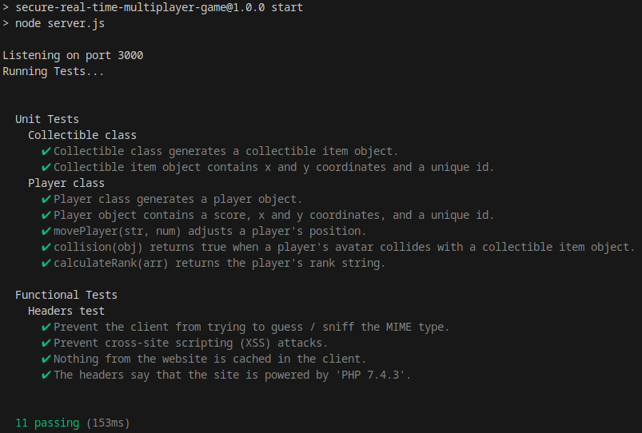

# freeCodeCamp Information Security Certificate

These are the projects I did in the completion of this certificate.

[Here](https://www.freecodecamp.org/certification/fcc30aca8b2-d2c4-4009-a397-2e6d1ecbde3b/information-security-v7) is my certificate on freeCodeCamp.

## Projects

### Stock Price Checker

Returns information about Nasdaq stocks. You can enter one or two stock names to check, and optionally like the stocks. When viewing one stock, the like counter is shown. When viewing two stocks, a relative like counter between the two is shown. I used Express to handle routes, a MongoDB database to store stock information, and wrote functional tests using the Chai library. Likes are based on IP addresses which are hashed using Bcrypt before being stored. In addition, Helmet.js is used for setting HTTP headers to improve security.



### Anonymous Message Board

Message board with threads and replies, as well as deletion and reporting capabilities. When making a thread or reply, you set a deletion password which is hashed using Bcrypt before being stored. Routes are handled with Express, MongoDB is used for the database, and functional tests use the Chai library. In addition, Helmet.js is used for setting HTTP headers to improve security.



### Port Scanner

Scans an IP or URL for open ports from a range of ports passed in by the user. The program is written in Python and uses the socket module.



### SHA-1 Password Cracker

Hashes passwords from a list of passwords to determine if it matches a given hash. With use_salts set to true, the function will prepend and append salts to each password before hashing. The program is written in Python and uses the hashlib module.



### Secure Real Time Multiplayer Game

A multiplayer game written in JavaScript using Node.js, HTML Canvas API, Socket.io, Express, and Helmet.js. The criteria given by freeCodeCamp was very open-ended: be able to move an avatar, have a collectible item, and a rank-based score. The game I made is called "Charge Race". Your goal is to collect power cells and maintain the highest charge level (which is represented by rank).

Note that while this project does meet the criteria given by freeCodeCamp, I don't consider it finished. The sprites are very simplistic and there is not much replay value (such as obstacles or other game modes). I also think a title screen and instructions would be helpful, as otherwise it may not be immediately clear how to play. 





## Skills

- Node.js
- Express
- Chai
- MongoDB
- Mongoose
- Bcrypt
- Helmet.js
- Python
- Socket.io

## Development Tools

- [VS Code](https://code.visualstudio.com/) - Development environment
- [Node.js](https://nodejs.org/en/) - JavaScript runtime environment
- [Git](https://git-scm.com/)/[GitHub](https://github.com/) - Version control
- [MongoDB Atlas](https://www.mongodb.com/) - Provides the database used

## Running the Projects
You will need node.js installed. To run a project, navigate to the project folder, open a terminal window, then type ```npm install```, then ```npm start```. This will start a local server that can be viewed in a web browser.

The Stock Price Checker and Anonymous Message Board projects require a database on MongoDB Atlas. [Here](https://www.freecodecamp.org/news/get-started-with-mongodb-atlas/) is a guide to create an account and set up a database. Once you have your URI string, create a file called .env in the project folder, then assign the URI string to MONGO_URI.

Projects using Python will require Python to be installed in order to run locally.
